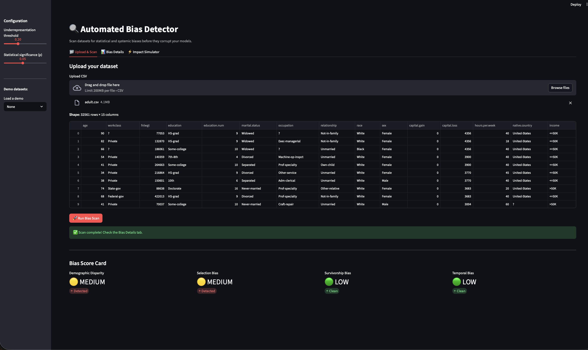

# Automated Bias Detector

> Scan datasets for statistical and systemic biases before they corrupt your models — with explainable findings, synthetic balancing, and real model impact simulation.

---

## About

This project aims to give data scientists and ML engineers a first-line defense against biased training data — automatically detecting where bias lives, explaining why it matters in concrete terms, showing its measurable impact on model fairness, and suggesting fixes before a single model is trained.

---

## The Problem

70% of ML failures trace back to bad or biased data, not bad models. Yet most teams audit models for fairness after training — by which point the damage is already baked in. Existing tools like Great Expectations or Evidently flag data quality issues but do not detect systemic bias in who is represented, how outcomes are distributed, or how distributions shift over time. This tool fills that gap.

---

## What Makes This Novel

- **Bias in data, not in models** — every existing fairness tool (Fairlearn, AI Fairness 360, What-If Tool) operates on trained models. This tool operates upstream, on the raw dataset itself, before any model is involved.
- **Root cause explainability** — instead of just flagging a column, the detector generates a concrete plain-English explanation: "African-Americans make up 11% of this dataset but 13.4% of the US population. A model trained here will have seen 847 examples of this group vs 3,200 Caucasian examples."
- **Closed-loop impact simulation** — trains a RandomForest on both the original biased dataset and the synthetically balanced one, then shows side-by-side per-group precision, recall, and F1. You see the exact performance gap caused by the bias.
- **Bias monitoring over time** — tracks every scan with a timestamp and snapshot label, then plots severity scores across versions so teams can see whether their data cleaning is actually reducing bias or making it worse.
- **Custom reference distributions** — the demographic checker ships with US Census defaults but lets teams define their own expected distributions (e.g. "our customer base is 60% female, 30% Asian") so comparisons are domain-relevant, not generic.

---

## Features

### Four Bias Detectors
| Detector | Method | What it catches |
|---|---|---|
| Demographic Disparity | Chi-squared test vs reference population | Underrepresented groups in protected attribute columns |
| Selection Bias | Correlated missingness (chi-squared), skewness analysis | Non-random missing data, narrow population slices |
| Survivorship Bias | Outcome dominance analysis | Datasets that only captured "winners" — hides failures |
| Temporal Bias | Kolmogorov-Smirnov test across time windows | Feature distributions that shift over time |

### Explainability Engine
Every detected bias is accompanied by a plain-English summary and concrete examples showing the real-world impact — including exact row counts, percentage gaps, and what a downstream model will learn incorrectly as a result.

### Synthetic Balancing
Two methods to fix detected bias:
- **SMOTE** — oversamples the minority class using nearest-neighbor interpolation for numeric/binary targets
- **CTGAN** — trains a conditional GAN to generate realistic synthetic rows for underrepresented demographic groups, with bootstrap fallback if CTGAN is unavailable

### Model Impact Simulator
Trains a RandomForest classifier on both the original and balanced dataset, then compares:
- Overall accuracy, precision, recall, F1
- Per-group breakdown for any protected attribute
- Delta metrics showing exactly how much minority group performance improves after balancing

### 📄 PDF Report Export
Generates a downloadable, formatted PDF report containing the full bias audit — score summary table, demographic distribution charts, temporal drift tables, explainability narratives, and model impact comparison. Production-ready artifact for sharing findings with stakeholders.

### 📈 Bias Over Time
Every scan is saved with a timestamp and optional label (e.g. "Jan 2024", "post-cleaning", "v2"). The trend tab plots severity scores and affected column counts across snapshots so teams can monitor whether data interventions are working.

### ⚙️ Custom Reference Distributions
Override the built-in US Census defaults with domain-specific population expectations. Define your own group proportions (e.g. regional demographics, customer base composition) and all future scans will compare against your reference instead.

---

## Architecture
```
bias-agent/
├── core/
│   ├── profiler.py              # Column fingerprinting, type inference, protected attr detection
│   ├── bias_detectors/
│   │   ├── demographic_bias.py  # Chi-squared group representation test
│   │   ├── selection_bias.py    # Correlated missingness + skew detection
│   │   ├── survivorship_bias.py # Outcome dominance analysis
│   │   └── temporal_bias.py     # KS-test distribution drift over time
│   ├── explainability.py        # Plain-English bias explanations with concrete examples
│   ├── synthetic.py             # SMOTE + CTGAN balancing
│   ├── impact.py                # RandomForest biased vs balanced comparison
│   ├── report.py                # ReportLab PDF generation
│   ├── history.py               # Scan persistence and trend building
│   └── reference_store.py       # Built-in + custom reference distributions
├── api/
│   └── main.py                  # FastAPI — 8 endpoints
├── ui/
│   └── app.py                   # Streamlit — 5 tabs
└── tests/
└── test_detectors.py
```
---
**Stack:** Python · FastAPI · Streamlit · scikit-learn · imbalanced-learn · CTGAN · SciPy · Plotly · ReportLab

---

## Setup

```bash
# Clone
git clone https://github.com/deevredd/bias-agent.git
cd bias-agent

# Create virtual environment
python -m venv venv
source venv/bin/activate        # Windows: venv\Scripts\activate

# Install dependencies
pip install -r requirements.txt
```

## Run

```bash
# Terminal 1 — API
uvicorn api.main:app --reload

# Terminal 2 — UI
streamlit run ui/app.py
```

Open **http://localhost:8501** in your browser.

---

## Demo Datasets

Download and place in a `datasets/` folder:

| Dataset | Biases it demonstrates |
|---|---|
| [COMPAS Recidivism](https://raw.githubusercontent.com/propublica/compas-analysis/master/compas-scores-two-years.csv) | Demographic disparity, temporal bias |
| [Titanic](https://raw.githubusercontent.com/datasciencedojo/datasets/master/titanic.csv) | Survivorship bias, selection bias |
| [Adult Income](https://raw.githubusercontent.com/dsrscientist/dataset1/master/adult.csv) | Demographic disparity, selection bias |

---

## API Endpoints

| Method | Endpoint | Description |
|---|---|---|
| POST | `/analyze` | Upload dataset, receive full bias report |
| POST | `/balance/smote` | Balance binary target with SMOTE |
| POST | `/balance/demographic` | Augment underrepresented group with CTGAN |
| POST | `/simulate-impact` | Compare model performance biased vs balanced |
| POST | `/report/pdf` | Download PDF bias audit report |
| GET | `/history/trend` | Bias severity over time for a dataset |
| GET | `/references` | List all active reference distributions |
| POST | `/references/custom` | Add a custom reference distribution |

---

## Screenshots




